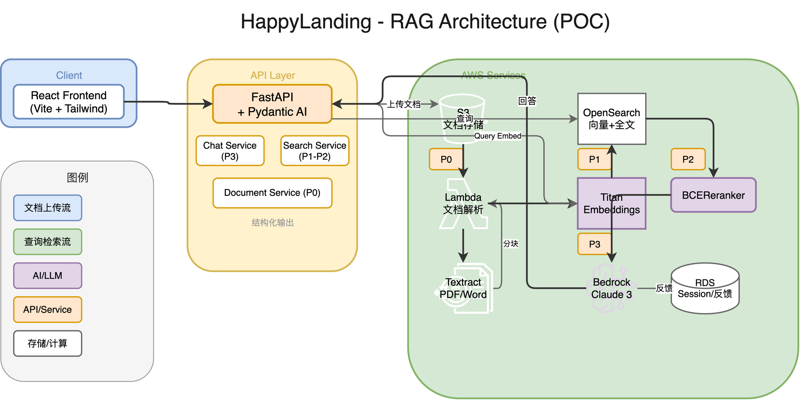
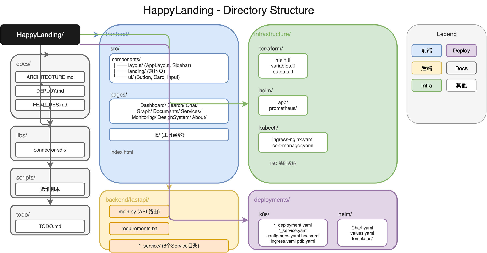

# HappyLanding - 企业知识管理系统

一站式企业团队知识协同管理平台。整合多渠道办公资源、云端文件、业务文档、行业资料与个人经验沉淀，搭建统一信息中枢。

## 功能概览

| 功能 | 说明 | 状态 |
|------|------|------|
| 统一搜索 | 全文 + 向量混合搜索（Hybrid Search） | 规划中 |
| 知识图谱 | 实体关系可视化（待接入 Neptune） | 规划中 |
| AI 对话 | 企业知识问答（RAG + Bedrock Claude） | 规划中 |
| 文档管理 | 多格式文档解析与存储（S3 + Textract） | 规划中 |
| 入职指引 | 新员工知识库引导 | 规划中 |
| 项目交接 | 项目资料全流程管理 | 规划中 |

### RAG 架构（规划中）



**数据流：**
```
文档上传 → S3 → Lambda 解析 → Textract → 分块 → Titan Embedding → OpenSearch
                                                        ↓
用户问题 → Titan Embedding → Hybrid Search (kNN + BM25) → Rerank → Bedrock Claude → 回答
```

**POC 阶段技术选型：**
- AI 框架：Pydantic AI（结构化输出）
- LLM：boto3 Bedrock 直连
- Embedding：boto3 Titan Embeddings 直连
- 向量存储：opensearch-py 直连
- 文档解析：boto3 + Textract 直连

**未来演进（按需引入）：**
- Temporal：文档处理流程变复杂、有人工审批、补偿事务需求
- LangGraph：引入 multi-agent 协作、复杂推理分支

> 不使用 LangChain/LangGraph（POC 阶段）— 依赖过重，调试困难，直接调用 boto3 更轻量稳定。

## 技术栈

| 层级 | 技术 | 说明 |
|------|------|------|
| 前端 | React 18 + Vite + Tailwind CSS v4 + shadcn/ui | 微拟物设计 |
| 后端 | FastAPI (Python 3.11) + Pydantic AI | 结构化 AI 输出 |
| 部署 | AWS ECS Fargate / EKS Kubernetes | 双模式支持 |
| 搜索 | Amazon OpenSearch + Hybrid Search | kNN + BM25 混合检索 |
| 图数据库 | Amazon Neptune（规划中） | Gremlin 查询 |
| AI | AWS Bedrock Claude 3 + Titan Embeddings | boto3 直连 |
| 存储 | Amazon S3 + AWS Textract | 文档解析 |
| 认证 | AWS Cognito（规划中） | JWT |
| 数据库 | RDS PostgreSQL | 会话 + 反馈存储 |
| 监控 | Prometheus + Grafana + Alertmanager（EKS 模式） | |

## 当前状态

> **开发中**：后端当前为 Mock 实现，前端已完整。
> **下一步**：RAG POC — 企业知识问答（Document → Search → Chat 链路）

### RAG POC 实施计划

| 阶段 | 内容 |
|------|------|
| P0 | 文档解析 Lambda（S3 → Textract → 纯文本） |
| P1 | Embedding pipeline（分块 → Titan → OpenSearch） |
| P2 | Hybrid Search + Rerank |
| P3 | Bedrock Claude 生成（端到端对话） |
| P4 | 反馈收集（评分/点赞数据） |

## 目录结构



```
HappyLanding/
├── frontend/                    # React 前端
│   ├── src/
│   │   ├── components/         # UI 组件（shadcn/ui + 微拟物设计）
│   │   │   ├── layout/         # AppLayout, Sidebar
│   │   │   ├── landing/        # 落地页组件
│   │   │   └── ui/             # Button, Card, Input, Badge
│   │   ├── pages/              # 页面
│   │   │   ├── Dashboard/      # 控制台
│   │   │   ├── Search/         # 搜索页
│   │   │   ├── Chat/           # AI 对话页
│   │   │   ├── Graph/          # 知识图谱
│   │   │   ├── Documents/      # 文档管理
│   │   │   ├── Services/       # 服务状态
│   │   │   ├── Monitoring/     # 监控入口
│   │   │   ├── DesignSystem/   # 设计系统
│   │   │   └── About/          # 关于
│   │   └── lib/                # 工具函数
│   └── index.html
│
├── backend/
│   └── fastapi/                # FastAPI 后端
│       ├── main.py            # API 路由（Mock 数据）
│       ├── requirements.txt
│       └── *_service/          # 8 个 Service 目录（规划中）
│
├── infrastructure/             # IaC 基础设施
│   ├── terraform/              # AWS 基础设施代码
│   │   ├── main.tf            # ECS / EKS 资源配置
│   │   ├── variables.tf        # 可配置变量
│   │   └── outputs.tf         # 输出（kubectl 命令等）
│   ├── helm/                  # Helm Chart
│   │   ├── app/               # 应用部署
│   │   └── prometheus/        # 监控配置
│   └── kubectl/               # K8s 资源（EKS 模式专用）
│       ├── ingress-nginx.yaml
│       └── cert-manager.yaml
│
├── deployments/               # K8s/Helm 部署配置
│   ├── k8s/                   # 原生 K8s YAML
│   └── helm/                  # Helm Chart
│
├── docs/                      # 用户文档
│   ├── ARCHITECTURE.md        # 系统架构
│   ├── DEPLOY.md              # 部署指南
│   └── FEATURES.md            # 功能说明
│
├── libs/                      # 共享库
│   └── connector-sdk/          # Python 连接器 SDK
│
├── scripts/                    # 运维脚本
└── todo/                       # 开发待办
```

## 部署模式

| 模式 | 说明 | 适用场景 |
|------|------|---------|
| **ECS Fargate** | 简单部署，无需管理集群 | 内部工具、小规模、演示 |
| **EKS Kubernetes** | 完整编排，需要 K8s 管理 | 生产环境、需要 HPA/自动扩缩容 |

### ECS 模式（简单部署）

```bash
cd infrastructure/terraform
echo 'deployment_mode = "ecs"' > terraform.tfvars
terraform init && terraform apply

# 构建并推送镜像
docker build -t <account>.dkr.ecr.us-east-1.amazonaws.com/happylanding-frontend:latest ./frontend
docker push <account>.dkr.ecr.us-east-1.amazonaws.com/happylanding-frontend:latest

docker build -t <account>.dkr.ecr.us-east-1.amazonaws.com/happylanding-backend:latest ./backend/fastapi
docker push <account>.dkr.ecr.us-east-1.amazonaws.com/happylanding-backend:latest

# 访问 http://<alb-dns-name>
```

### EKS 模式（完整 K8s）

```bash
cd infrastructure/terraform
echo 'deployment_mode = "eks"' > terraform.tfvars
terraform init && terraform apply

# 配置 kubectl
aws eks update-kubeconfig --region us-east-1 --name happylanding-cluster

# 安装 Ingress + cert-manager
kubectl apply -f infrastructure/kubectl/ingress-nginx.yaml
helm install cert-manager jetstack/cert-manager --namespace cert-manager --create-namespace --set installCRDs=true
kubectl apply -f infrastructure/kubectl/cert-manager.yaml

# 部署应用
helm install happylanding ./infrastructure/helm/app -n happylanding --create-namespace

# 部署监控
helm install prometheus prometheus-community/kube-prometheus-stack -n monitoring --create-namespace -f ./infrastructure/helm/prometheus/values.yaml
```

详见 [docs/DEPLOY.md](docs/DEPLOY.md)

## 快速开始

### 前端开发

```bash
cd frontend
npm install
npm run dev
# 访问 http://localhost:3000
```

### 后端开发

```bash
cd backend/fastapi
python3 -m venv .venv
source .venv/bin/activate
pip install -r requirements.txt
uvicorn main:app --reload --port 8080
# 访问 http://localhost:8080
```

## 页面导航

| 路径 | 页面 | 说明 |
|------|------|------|
| `/` | 控制台 | 系统信息 + 服务入口 |
| `/search` | 搜索服务 | UI 完成，RAG 规划中 |
| `/chat` | AI 对话 | UI 完成，RAG 规划中 |
| `/graph` | 知识图谱 | UI 完成，Neptune 规划中 |
| `/documents` | 文档管理 | UI 完成，S3 + Textract 规划中 |
| `/services` | 服务状态 | Mock 数据 |
| `/monitoring` | 监控面板 | Grafana/Alertmanager 入口 |
| `/design-system` | 设计系统 | UI 组件展示 |
| `/about` | 关于 | 项目介绍 |

## 设计系统

微拟物光影质感（Micro-fakery）：

- **Button**：raised / glass 变体，8 种状态
- **Card**：raised / inset / flat 变体，hover 发光
- **Input**：inset / flat 变体，focus 阴影
- **Badge**：gradient 渐变背景

详见 `/design-system` 页面

## License

Proprietary